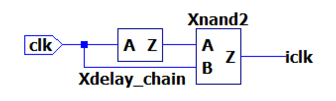
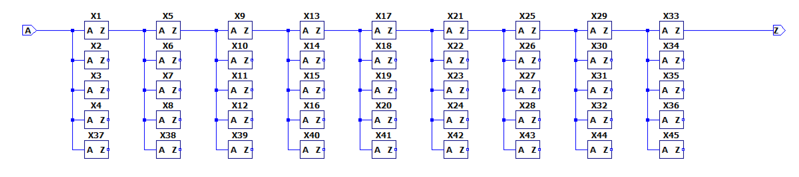
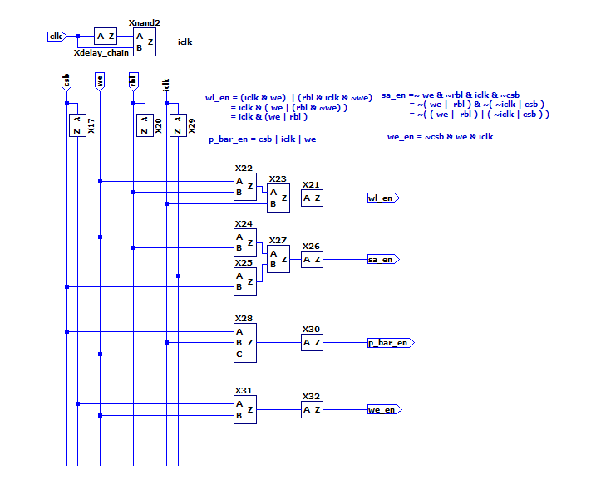

# SRAM 电路实现

16x4 仿真电路实现：

电路模块划分：

- Bitcell 阵列；
- Replica Bitcells 阵列；
- 行译码器、列选择器；
- 预充电；
- 写驱动；
- 敏感放大器；
- 逻辑控制模块；

## Bitcell

经典 6T SRAM Bitcell：

## Row Decoder

只要常规的译码电路（分层译码）。

## Column Mux

PMOS 三态门选择器：

## Sense Amplifier

一对交叉耦合反相器构成，类似 6T SRAM Bitcell：

当 en 为低电平，两个 Access PMOS 开启，但尾电流源 NMOS 管关闭，放大器失能，但外部变化的电压会反应在输入栅极上。

当 en 为高电平，Access 管关闭，电流源开启，放大器使能。最后将其输出经过两级放大器得到数据。

## Write Driver

三态门写驱动：

we 为低电平，br 与 bl 相对输出为高阻。否则 br 与 bl 连接到反相器输出。对 bl 与 br 充放电。

## Logic Control 1

SRAM 控制线逻辑控制模块（rbl 表示电压已经下降到足够被敏感放大器检测）：

需要控制：p_en_bar（预充电）、we_en（写使能）、sa_en（放大器使能）、wl_en（位线选择）。

### 写操作

- p_en_bar：始终关闭；
- we_en：始终开启。将 bl、br 设置到高/低电平；
- sa_en：始终关闭；
- wl_en：始终开启。开始对 Bitcell 进行设置；

### 读操作

- p_en_bar：上半周期开启、下半周期关闭。将 bl、br 设置位高电平；
- we_en：始终关闭；
- sa_en：上半周期关闭，在下半周期直到 rbl 电平从高到低（可以被敏感放大器检测到）之后开启；
- wl_en：上半周期关闭、下半周期开启，直到 rbl 电平从高到低（可以被敏感放大器检测到）之后关闭；

### 实现原理

replica bitcell 直接位于 sram bank 上，其寄生参数，特别是字线电容与 正常工作 的 bitcell 一致。

本例中，8 个 replica bitcells 共用 bitline，即 rbl。其中三个 cell 的 wl 总是为 0，剩下 5 个直接连接到 wl_en，所以不管需要对哪个 cell 进行读写，总会激活这 5 个 replica bitcells。

当对 SRAM 进行写操作的时候，总是对这五个 cells 写入 0。对 SRAM 进行读操作的时候，也会同样对这 5 个 bitcell 进行操作：rbl 预充电、放电。

replica 的原理就是：通过检测这个 rbl，将其变化量作为正常的 bitcell 是否可以被敏感放大器检测到的标志。

但实际上，replica bitcells 的 rbl 没有连接任何敏感放大器，其直接连接到了 logic control 中的 rbl，进入到反相器中。所以二者的阈值实际上并不相同：

- normal cell 的字线需要下降到：足够触发敏感放大器（约为 VDD/10）；
- replica cell 的子线连接到 Logic Control 中的反相器，其需要下降到触发反相器（约为 VDD/2）；

为了让二者达到阈值的时间大致相同，那么需要保证：replica 放电电流为 normal cell 放电电流的 5 倍：
$$
\Delta Q = C \Delta U = It
$$
为了达到电流要求，所以使用 5 个 bitcell 进行放电。

## Logic Control 2

对第一种实现方式，很明显存在的问题：

- 读操作：上半周期完全用于预充电，导致读延时很大。实际上充电过程是很快就可以完成；
- 写操作：在 BL 与 BLB 没有充电（放电）到对应的电平，而直接开启 WL 信号是一种浪费。

### 理想时序

对读操作，最理想的时序应该是：

1. BL、BLB 预充电至 VDD；
2. 开启 WL；
3. BL、BLB 电压差达到敏感放大器阈值，开启放大器，输出读取的数字量。

三者之间不存在间隔，是理论上最快的读时序。对 2、3 步骤，使用 replica 技术尽可能满足要求。但是对 1、2 步骤使用 replica 是不现实的。可以使用反相器链的方法处理。

对写操作：

1. BL、BLB 预充电到期望值；
2. 开启 WL；

### Delay Chain

希望的是在 CLK 从 0 到 1 变化时，预充电开启一段时间，而非半个周期，可以采用以下电路实现：

其中 delay chain 使用多个反相器级联组成：

Z 与 A 逻辑上是取反的。每级间增加扇出是为了增加延时。

1. 当 clk 稳定为 0 时，nand2 输入分别为 1、0，输出 iclk 为 1；
2. 当 clk 升沿到来，nand2 B 端口输入为 1，而由于 delay chain，A 端口也为 1，输出 iclk 为 0；
3. 延时时间到，nand2 A 端口变为 0，输出 iclk 为 1；

每次 clk 从 0 到 1，iclk 出现一小段时间的 0，用于启动预充电。并且这个电路在 clk 从 1 到 0 时是不会变化的。

### 电路实现

使用 delay chain 与 replica 技术，可得四个控制信号的逻辑表达式：
$$
wl\_en = (iclk * we)  + (rbl * iclk * we')= iclk * (we + rbl)
$$

$$
sa\_en = we' * rbl' * iclk * csb' 
           = ( we + rbl )' * ( iclk' + csb )'
$$

$$
p\_bar\_en = csb + iclk + we
$$

$$
we\_en = csb' * we * iclk
$$

电路实现如下：

