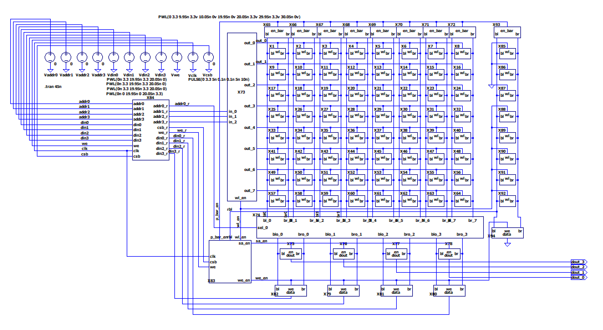
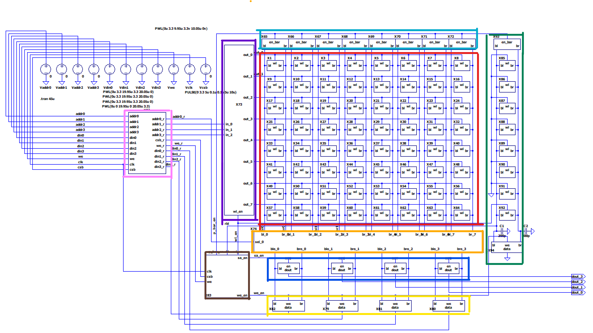
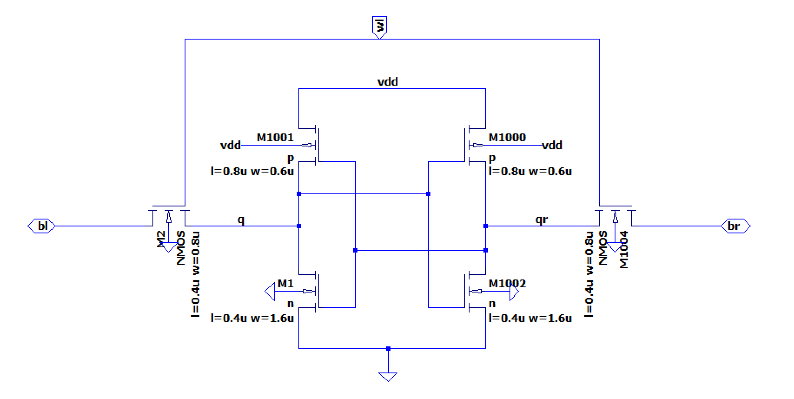
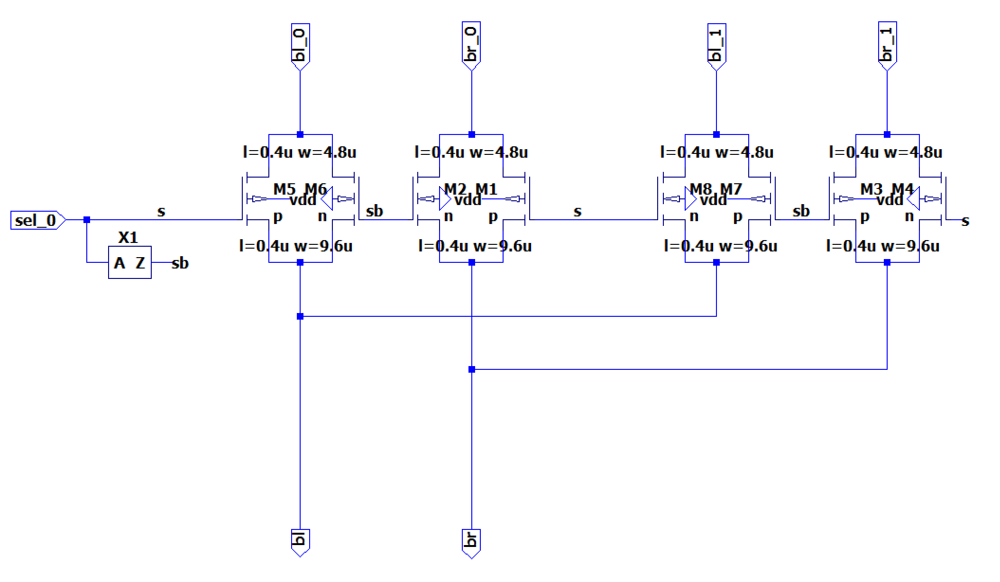
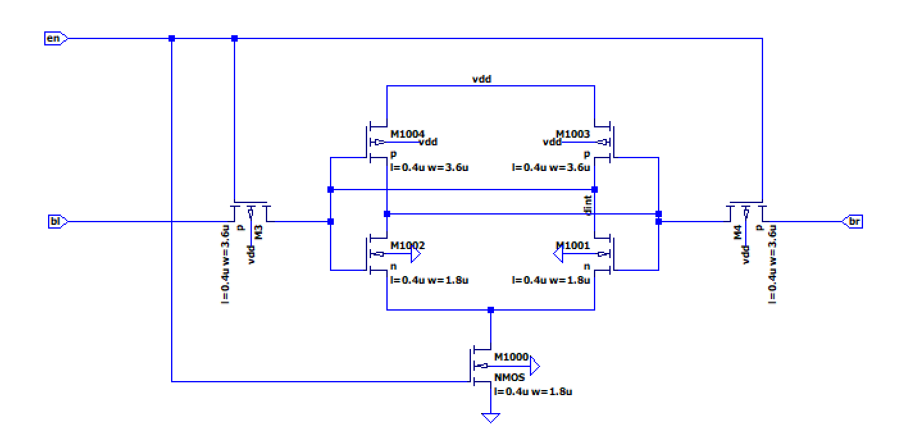
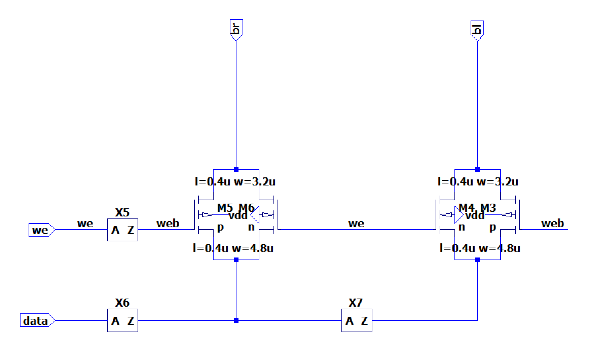
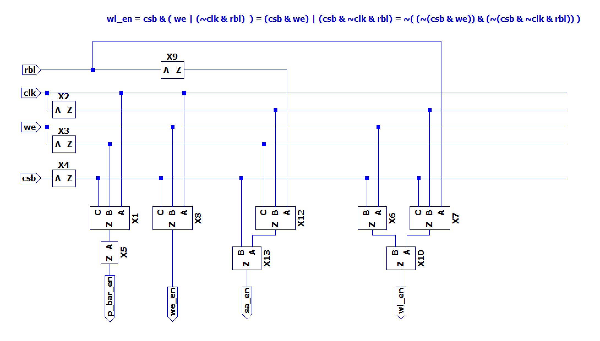
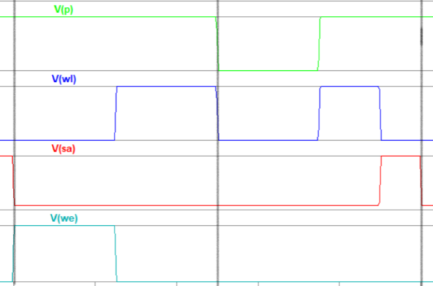
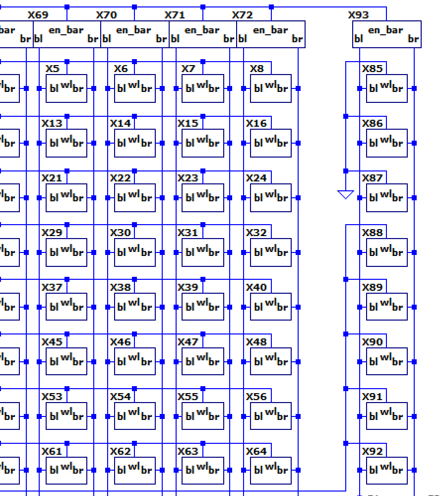

# SRAM 电路实现

16x4 仿真电路实现：

电路模块划分：

- Bitcell 阵列；
- Replica Bitcells 阵列；
- 行译码器、列选择器；
- 预充电；
- 写驱动；
- 敏感放大器；
- 逻辑控制模块；

## Bitcell

经典 6T SRAM Bitcell：

## Row Decoder

只要常规的译码电路（分层译码）。

## Column Mux

PMOS 三态门选择器：

## Sense Amplifier

一对交叉耦合反相器构成，类似 6T SRAM Bitcell：

当 en 为低电平，两个 Access PMOS 开启，但尾电流源 NMOS 管关闭，放大器失能，但外部变化的电压会反应在输入栅极上。

当 en 为高电平，Access 管关闭，电流源开启，放大器使能。最后将其输出经过两级放大器得到数据。

## Write Driver

三态门写驱动：

we 为低电平，br 与 bl 相对输出为高阻。否则 br 与 bl 连接到反相器输出。对 bl 与 br 充放电。

## Logic Control

SRAM 控制线逻辑控制模块（rbl 表示电压已经下降到足够被敏感放大器检测）：

需要控制：p_en_bar（预充电）、we_en（写使能）、sa_en（放大器使能）、wl_en（位线选择）。

### 写操作

- p_en_bar：始终关闭；
- we_en：始终开启。将 bl、br 设置到高/低电平；
- sa_en：始终关闭；
- wl_en：始终开启。开始对 Bitcell 进行设置；

### 读操作

- p_en_bar：上半周期开启、下半周期关闭。将 bl、br 设置位高电平；
- we_en：始终关闭；
- sa_en：上半周期关闭，在下半周期直到 rbl 电平从高到低（可以被敏感放大器检测到）之后开启；
- wl_en：上半周期关闭、下半周期开启，直到 rbl 电平从高到低（可以被敏感放大器检测到）之后关闭；

### 实现原理

replica bitcell 直接位于 sram bank 上，其寄生参数，特别是字线电容与 正常工作 的 bitcell 一致。

本例中，8 个 replica bitcells 共用 bitline，即 rbl。其中三个 cell 的 wl 总是为 0，剩下 5 个直接连接到 wl_en，所以不管需要对哪个 cell 进行读写，总会激活这 5 个 replica bitcells。

当对 SRAM 进行写操作的时候，总是对这五个 cells 写入 0。对 SRAM 进行读操作的时候，也会同样对这 5 个 bitcell 进行操作：rbl 预充电、放电。

replica 的原理就是：通过检测这个 rbl，将其变化量作为正常的 bitcell 是否可以被敏感放大器检测到的标志。

但实际上，replica bitcells 的 rbl 没有连接任何敏感放大器，其直接连接到了 logic control 中的 rbl，进入到反相器中。所以二者的阈值实际上并不相同：

- normal cell 的字线需要下降到：足够触发敏感放大器（约为 VDD/10）；
- replica cell 的子线连接到 Logic Control 中的反相器，其需要下降到触发反相器（约为 VDD/2）；

为了让二者达到阈值的时间大致相同，那么需要保证：replica 放电电流为 normal cell 放电电流的 5 倍：
$$
\Delta Q = C \Delta U = It
$$
为了达到电流要求，所以使用 5 个 bitcell 进行放电。

## Question

- SRAM 电路模块实现是否完备、合理。
- 在前仿出现 Delay 问题时，需要修改哪个电路模块进行改进。