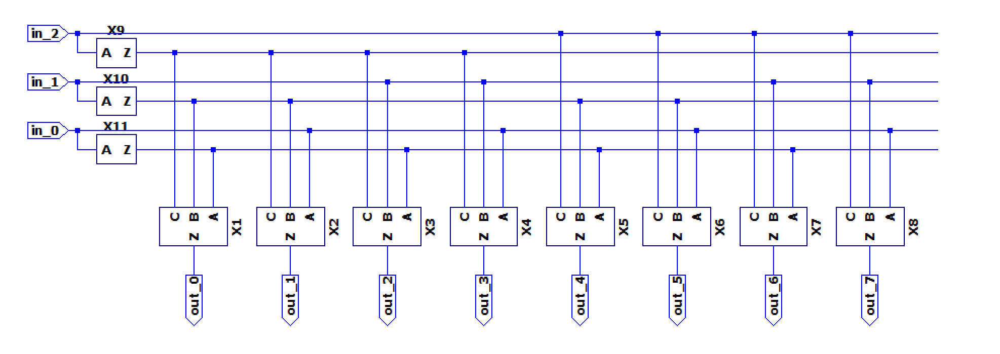

# SRAM 电路实现

16x4 仿真电路实现：

电路模块划分：

- Bitcell 阵列；
- Replica Bitcells 阵列；
- 行译码器、列选择器；
- 预充电；
- 写驱动；
- 敏感放大器；
- 逻辑控制模块；

## Bitcell

经典 6T SRAM Bitcell：

## Row Decoder

只要常规的译码电路（分层译码）。

## Column Mux

PMOS 三态门选择器：

## Sense Amplifier

一对交叉耦合反相器构成，类似 6T SRAM Bitcell：

当 en 为低电平，两个 Access PMOS 开启，但尾电流源 NMOS 管关闭，放大器失能，但外部变化的电压会反应在输入栅极上。

当 en 为高电平，Access 管关闭，电流源开启，放大器使能。最后将其输出经过两级放大器得到数据。

## Write Driver

三态门写驱动：

we 为低电平，br 与 bl 相对输出为高阻。否则 br 与 bl 连接到反相器输出。对 bl 与 br 充放电。

## Logic Control

SRAM 控制线逻辑控制模块：

需要控制：p_en_bar（预充电）、we_en（写使能）、sa_en（放大器使能）、wl_en（位线选择）。

### 写操作

- p_en_bar：始终关闭；
- we_en：上半周期开启、下半周期关闭。将 bl、br 设置到高/低电平；
- sa_en：始终关闭；
- wl_en：上半周期关闭、下半周期开启。开始对 Bitcell 进行设置；

### 读操作

- p_en_bar：上半周期开启、下半周期关闭。将 bl、br 设置位高电平；
- we_en：始终关闭；
- sa_en：上半周期关闭，在下半周期直到 rbl 电平从高到低（可以被敏感放大器检测到）之后开启；
- wl_en：上半周期关闭、下半周期开启，直到 rbl 电平从高到低（可以被敏感放大器检测到）之后关闭；